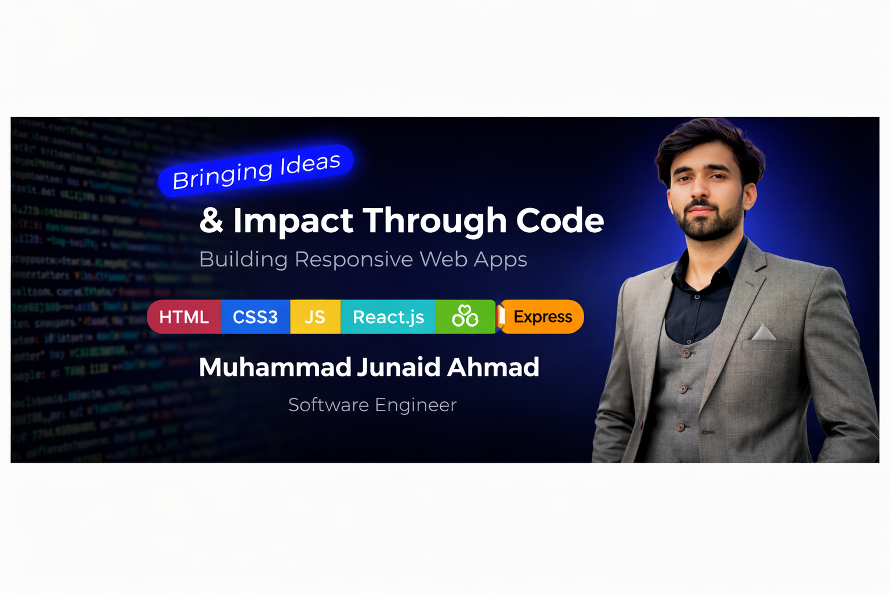

<!-- Banner -->

  

<h1 align="center">👋 Hi there, I'm Muhammad Junaid Ahmad</h1>
<h3 align="center"> Software Engineer</h3>

---

## 🚀 About Me

- 💻 Frontend Developer with strong grip on modern UI technologies  
- ⚡ Passionate about building responsive & scalable web apps  
- 🌱 Currently improving React & Full Stack (MERN)  
- 🎯 Goal: Become a Full Stack Developer  

---

## 🧰 Tech Stack

### 🎨 Frontend

  

### ⚙️ Backend (Basic Level)

  

### 🛠️ Tools & Others

  

---

---

## 🌐 Connect With Me

  
  

---

## 💡 Quote

> "Turning ideas into impactful code 🚀"
